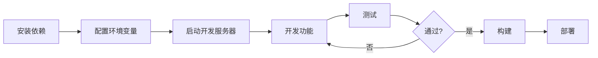

# 系统安装需求总结 / System Installation Requirements Summary

> **文档用途**: 本文档提供了项目的完整安装需求和配置说明摘要
> **Document Purpose**: This document provides a complete summary of installation requirements and configuration instructions

---

## 📋 总览 / Overview

**项目名称**: Next.js 15 + MDX + i18n 集成项目  
**当前版本**: 1.0  
**创建日期**: 2025-10-19

---

## 🔧 系统要求 / System Requirements

### 必需环境 / Required Environment

| 软件 | 最低版本 | 推荐版本 | 安装命令 |
|------|----------|----------|----------|
| Node.js | 18.x | 20.x+ | 从官网下载 |
| pnpm | 8.x | 最新版 | `npm install -g pnpm` |

### 为什么使用 pnpm？

✅ **更快的安装速度** - 使用硬链接节省磁盘空间  
✅ **更严格的依赖管理** - 避免幽灵依赖  
✅ **与本项目兼容性更好** - npm 在某些包安装时会出错

---

## 📦 核心依赖 / Core Dependencies

### MDX 相关包

```bash
pnpm add @next/mdx @mdx-js/loader @mdx-js/react @types/mdx
```

| 包名 | 版本 | 用途 |
|------|------|------|
| @next/mdx | ^15.5.6 | Next.js MDX 插件 |
| @mdx-js/loader | ^3.1.1 | Webpack MDX 加载器 |
| @mdx-js/react | ^3.1.1 | React MDX 运行时 |
| @types/mdx | ^2.0.13 | TypeScript 类型定义 |

### 框架和核心库

```json
{
  "next": "15.5.5",
  "react": "^19.0.0",
  "react-dom": "^19.0.0",
  "typescript": "^5.0.0",
  "tailwindcss": "^4.0.0",
  "next-intl": "^3.26.2"
}
```

---

## ⚙️ 配置文件清单 / Configuration Files Checklist

### 1. next.config.ts ✅

**关键配置点**:
- 添加 MDX 插件支持
- 配置页面扩展名包含 `.mdx`
- 集成 next-intl 插件

```typescript
import createMDX from '@next/mdx';
import createNextIntlPlugin from 'next-intl/plugin';

const withNextIntl = createNextIntlPlugin();
const nextConfig: NextConfig = {
  pageExtensions: ['js', 'jsx', 'md', 'mdx', 'ts', 'tsx'],
};
const withMDX = createMDX({
  extension: /\.mdx?$/,
  options: { remarkPlugins: [], rehypePlugins: [] },
});

export default withNextIntl(withMDX(nextConfig));
```

### 2. tsconfig.json ✅

**关键配置点**:
- 包含 `**/*.mdx` 文件

```json
{
  "include": ["**/*.ts", "**/*.tsx", "**/*.mdx"]
}
```

### 3. mdx-components.tsx ✅

**位置**: 项目根目录（强制要求）

```typescript
import type { MDXComponents } from 'mdx/types';
import { mdxComponents } from './components/mdx/MDXComponents';

export function useMDXComponents(components: MDXComponents): MDXComponents {
  return { ...mdxComponents, ...components };
}
```

### 4. package.json ✅

**关键脚本**:
```json
{
  "scripts": {
    "dev": "next dev --turbopack",
    "build": "next build",  // 注意：生产构建不使用 --turbopack
    "start": "next start"
  }
}
```

### 5. .env.local ⚠️

**需要手动创建**:
```bash
# Strapi 集成（可选）
NEXT_PUBLIC_STRAPI_API_URL=http://localhost:1337
STRAPI_API_TOKEN=your_api_token_here
```

---

## 📁 必需的目录结构 / Required Directory Structure

```
learning_nextjs_again/
├── app/                          # ✅ 必需 - Next.js 路由
│   ├── layout.tsx
│   └── page.tsx
├── components/                   # ✅ 必需 - React 组件
│   ├── Navigation.tsx
│   ├── PageWrapper.tsx
│   └── mdx/                      # MDX 自定义组件
│       └── MDXComponents.tsx
├── messages/                     # ✅ 必需 - i18n 翻译
│   ├── en.json
│   └── zh.json
├── docs/                         # 📚 推荐 - 项目文档
│   ├── README.md
│   ├── MDX_SETUP_GUIDE.md
│   └── QUICK_START_CN.md
├── mdx-components.tsx            # ✅ 必需 - 根目录
├── next.config.ts                # ✅ 必需
├── tsconfig.json                 # ✅ 必需
├── package.json                  # ✅ 必需
└── .env.local                    # ⚠️ 需创建
```

---

## 🚀 安装步骤（完整流程）/ Installation Steps (Complete)

### 步骤 1: 环境检查
```bash
node --version   # 应该 >= 18
pnpm --version   # 应该 >= 8
```

### 步骤 2: 克隆项目（如适用）
```bash
git clone <repository-url>
cd learning_nextjs_again
```

### 步骤 3: 安装依赖
```bash
pnpm install
```

### 步骤 4: 安装 MDX 支持
```bash
pnpm add @next/mdx @mdx-js/loader @mdx-js/react @types/mdx
```

### 步骤 5: 创建环境变量文件
```bash
touch .env.local
# 编辑 .env.local 添加必要的环境变量
```

### 步骤 6: 启动开发服务器
```bash
pnpm run dev
```

### 步骤 7: 验证安装
访问 `http://localhost:3000` 确认应用正常运行

---

## ⚠️ 已知问题和解决方案 / Known Issues & Solutions

### 问题 1: npm 安装失败
**症状**: `Cannot read properties of null (reading 'matches')`  
**解决**: 使用 pnpm 代替 npm

### 问题 2: Turbopack 构建错误
**症状**: `Module not found: @vercel/turbopack-next/internal/font/google/font`  
**解决**: 移除 build 脚本中的 `--turbopack` 标志

### 问题 3: Next.js 15 Params 类型错误
**症状**: `Type '{ slug: string }' is missing properties from type 'Promise<any>'`  
**解决**: 将 params 类型改为 `Promise<{ slug: string }>`

### 问题 4: window is not defined
**症状**: `ReferenceError: window is not defined`  
**解决**: 使用 Next.js 的 `usePathname()` 代替 `window.location.pathname`

### 问题 5: React 未导入
**症状**: `'React' refers to a UMD global`  
**解决**: 显式导入 `import React from 'react'`

详细解决方案请参考: [docs/MDX_SETUP_GUIDE.md](docs/MDX_SETUP_GUIDE.md#常见问题解决--common-issues--solutions)

---

## 🎯 功能特性 / Features

### ✅ 已实现功能

- [x] MDX 支持（在 `.mdx` 文件中使用 React 组件）
- [x] 国际化（中英文切换）
- [x] 响应式导航栏
- [x] 自定义 MDX 组件库
  - 交互式计数器
  - 提示框（Info/Warning/Success/Error）
  - 图表组件
  - 实时代码编辑器
  - 代码标签页
- [x] 页面包装器（统一布局）
- [x] Strapi CMS 集成（可选）
- [x] Dark Mode 支持
- [x] TypeScript 类型安全

---

## 📚 文档索引 / Documentation Index

| 文档名称 | 用途 | 适用场景 |
|---------|------|----------|
| [README.md](docs/README.md) | 文档导航 | 查找其他文档 |
| [MDX_SETUP_GUIDE.md](docs/MDX_SETUP_GUIDE.md) | 完整设置指南 | 首次安装、深入理解 |
| [QUICK_START_CN.md](docs/QUICK_START_CN.md) | 快速参考 | 日常开发、速查 |
| [INSTALLATION_SUMMARY.md](INSTALLATION_SUMMARY.md) | 安装需求总结 | 项目交接、快速了解 |

---

## 🔄 开发工作流 / Development Workflow



### 日常开发命令
```bash
pnpm run dev        # 启动开发服务器（端口 3000）
pnpm run build      # 构建生产版本
pnpm run start      # 启动生产服务器
pnpm run lint       # 代码检查
```

---

## 🌐 支持的语言 / Supported Languages

- 🇨🇳 中文 (zh)
- 🇺🇸 English (en)

添加新语言：
1. 在 `messages/` 创建新的 JSON 文件（如 `ja.json`）
2. 复制 `en.json` 的结构
3. 翻译所有文本
4. 更新 `i18n.ts` 配置

---

## 🔐 环境变量说明 / Environment Variables

| 变量名 | 必需? | 默认值 | 说明 |
|--------|------|--------|------|
| `NEXT_PUBLIC_STRAPI_API_URL` | 否 | - | Strapi API 地址 |
| `STRAPI_API_TOKEN` | 否 | - | Strapi API 令牌 |

**注意**: `NEXT_PUBLIC_*` 前缀的变量会暴露给客户端

---

## 📊 性能指标 / Performance Metrics

基于 Next.js 15 的生产构建：

```
Route (app)              Size    First Load JS
├ /                      5.89 kB    125 kB
├ /blog/hello-mdx        121 B      101 kB
├ /blog/advanced-mdx     1.45 kB    103 kB
└ /strapi-example        1.46 kB    120 kB

First Load JS shared     101 kB
```

---

## 🎓 学习资源 / Learning Resources

### 官方文档
- [Next.js 15 文档](https://nextjs.org/docs)
- [MDX 文档](https://mdxjs.com/)
- [next-intl 文档](https://next-intl-docs.vercel.app/)
- [Tailwind CSS 文档](https://tailwindcss.com/docs)

### 项目内部文档
- MDX 完整指南: `docs/MDX_SETUP_GUIDE.md`
- 快速开始: `docs/QUICK_START_CN.md`
- Strapi 集成: `docs/strapi-integration.md`

---

## 👥 团队协作 / Team Collaboration

### Git 工作流
```bash
# 创建功能分支
git checkout -b feature/your-feature

# 提交更改
git add .
git commit -m "feat: add new feature"

# 推送到远程
git push origin feature/your-feature
```

### 代码规范
- 使用 TypeScript 类型定义
- 遵循 ESLint 规则
- 组件使用函数式写法
- 客户端组件标记 `'use client'`

---

## 📞 支持和联系 / Support & Contact

### 遇到问题？
1. 查看 [常见问题速查](docs/QUICK_START_CN.md#五常见问题速查)
2. 阅读 [完整问题解决方案](docs/MDX_SETUP_GUIDE.md#常见问题解决--common-issues--solutions)
3. 查看项目 Issues
4. 联系开发团队

---

## ✅ 安装检查清单 / Installation Checklist

使用此清单确保所有步骤都已完成：

- [ ] Node.js >= 18 已安装
- [ ] pnpm >= 8 已安装
- [ ] 项目依赖已安装 (`pnpm install`)
- [ ] MDX 包已安装
- [ ] `next.config.ts` 已配置
- [ ] `tsconfig.json` 包含 `*.mdx`
- [ ] `mdx-components.tsx` 已创建（根目录）
- [ ] 翻译文件已创建（`messages/en.json`, `messages/zh.json`）
- [ ] `.env.local` 已创建（如需要）
- [ ] 开发服务器可正常启动
- [ ] 构建成功 (`pnpm run build`)
- [ ] 所有页面可正常访问

---

## 📅 版本历史 / Version History

| 版本 | 日期 | 主要变更 |
|------|------|----------|
| 1.0 | 2025-10-19 | 初始版本 - MDX 集成、国际化、导航系统 |

---

## 📄 许可证 / License

本项目遵循 MIT 许可证

---

**文档维护者**: Development Team  
**最后更新**: 2025-10-19  
**文档状态**: ✅ 已完成

---

## 🎯 下一步 / Next Steps

安装完成后，你可以：

1. 📖 阅读 [MDX_SETUP_GUIDE.md](docs/MDX_SETUP_GUIDE.md) 了解详细配置
2. 🚀 查看示例页面学习 MDX 用法
3. 🎨 自定义 Tailwind 主题
4. 📝 创建你的第一篇 MDX 文章
5. 🌐 添加更多语言支持

**祝你开发愉快！/ Happy coding!**
